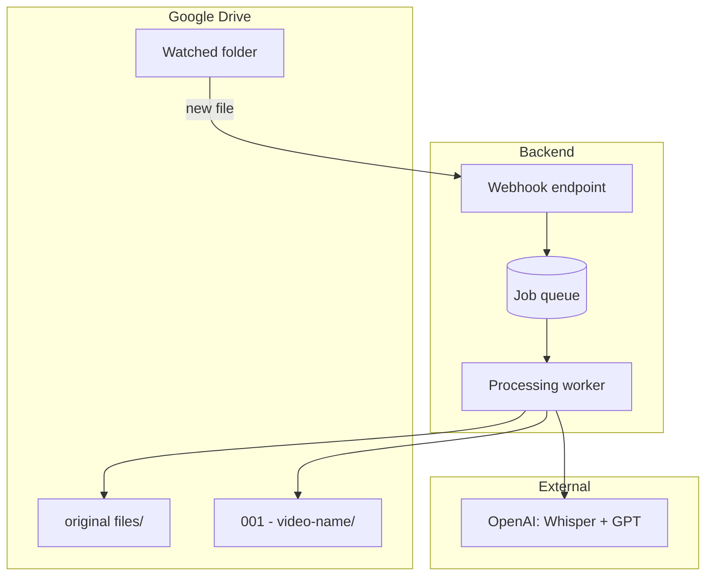

# Automated Shorts Generator – Plan

Generate YouTube Shorts from Slovak political interview videos automatically when files are uploaded to a Google Drive folder.

---

## Goal

- **Input:** User uploads a video to a watched Google Drive folder
- **Output:**
  1. Original file moved to `original files/`
  2. Shorts generated and saved in a new folder (e.g. `001 - video-name/` or `clips/video-name/`)
- **No website** – runs fully in the background

---

## Architecture Overview



---

## Components

### 1. Google Drive Setup

- **Google Cloud Project** with Drive API
- **Service Account** with JSON credentials
- **Watched folder** shared with the service account (`viewer` or `editor`)
- **Push notifications:** Drive API `changes.watch` or `files.watch` on the folder

### 2. Webhook Endpoint

- **Role:** Receive Drive change notifications
- **Flow:**
  1. Google POSTs to your URL when the folder changes
  2. Handler verifies request and finds new file(s)
  3. Enqueue jobs (e.g. in Supabase)
  4. Respond quickly (within Drive’s timeout)

- **Hosting:** Serverless (Netlify, Vercel, Cloud Run) or any server with a public URL

### 3. Job Queue

- **Store:** Supabase (or similar) for jobs
- **Schema (example):**
  - `id`, `drive_file_id`, `status`, `created_at`, `error`
- Worker polls or uses real-time subscriptions to pick new jobs

### 4. Processing Worker

- **Role:** Run the full pipeline
- **Flow:**
  1. Take job from queue
  2. Download file from Drive
  3. Transcribe (OpenAI Whisper)
  4. Find hook moments (GPT)
  5. Generate shorts (FFmpeg: trim, 9:16, subtitles)
  6. Move original to `original files/`
  7. Create output folder, upload shorts
  8. Mark job complete / failed

- **Env:** FFmpeg, Python or Node, OpenAI API key
- **Hosting:** Railway, Render, Fly.io, or a small VPS

---

## Tech Stack Options

| Layer          | Option A                 | Option B              | Option C         |
|----------------|--------------------------|-----------------------|------------------|
| Webhook        | Netlify Functions        | Vercel Functions      | Google Cloud Run |
| Queue + DB     | Supabase                 | Supabase              | Cloud Tasks + Firestore |
| Worker         | Python + FFmpeg          | Node + fluent-ffmpeg  | Python + FFmpeg |
| Drive API      | `googleapis` (Node) or `google-api-python-client` | Same | Same |

**Suggested stack:**  
Netlify/Vercel (webhook) + Supabase (queue) + Python worker on Railway/Render

---

## Data Flow (Detail)

### Step 1: New file in Drive

1. User uploads `interview.mp4` into the watched folder.
2. Drive sends a webhook to your endpoint.
3. Webhook fetches recent changes via Drive API and finds the new file.
4. Webhook inserts a row into the jobs table.

### Step 2: Worker processes job

1. Worker gets `drive_file_id` from the queue.
2. Downloads file from Drive using the Service Account.
3. Extracts audio, sends to Whisper → transcript + timestamps.
4. Sends transcript to GPT → suggested clips (start, end).
5. For each clip (or the best one):
   - FFmpeg: trim, crop 9:16, burn SRT, output MP4.
6. Drive API:
   - Move original to `original files/interview.mp4`.
   - Create folder `001 - interview` (or `clips/interview`).
   - Upload short(s) into that folder.
7. Update job status to `completed` or `failed`.

### Step 3: Folder layout in Drive

```
watched_folder/
├── original files/
│   ├── interview_2025_02.mp4
│   └── debate.mp4
├── 001 - interview_2025_02/
│   └── short_hook1.mp4
└── 002 - debate/
    ├── short_hook1.mp4
    └── short_hook2.mp4
```

---

## Google Cloud Setup

1. Create a project and enable **Google Drive API**.
2. Create a **Service Account** and download JSON.
3. Share the watched folder with the service account email (Editor).
4. Configure **Push notifications**:
   - `POST` to your webhook URL
   - Drive sends `X-Goog-*` headers for verification
   - Channel expires (typically 7 days) → needs periodic refresh

---

## Edge Cases

| Case                  | Handling                                                |
|-----------------------|---------------------------------------------------------|
| Duplicate uploads     | Track `drive_file_id` in jobs, skip already processed   |
| Channel expires       | Cron job to re-subscribe to Drive changes               |
| Failed job            | Mark job failed, optionally retry a few times           |
| Non-video file        | Skip or mark as failed with reason                      |
| No hooks found        | Still create folder; either no clips or single full clip|

---

## Environment Variables

```
# Worker
OPENAI_API_KEY=sk-...
GOOGLE_APPLICATION_CREDENTIALS=/path/to/service-account.json
# or inline: GOOGLE_DRIVE_CREDENTIALS={"type":"service_account",...}

# Supabase (if used)
SUPABASE_URL=...
SUPABASE_SERVICE_KEY=...

# Optional
WATCHED_FOLDER_ID=...   # Drive folder ID to watch
```

---

## Out of Scope (Phase 1)

- Website or UI
- Multiple watched folders
- Custom clip count (start with 1 short per video)
- Face tracking / smart crop
- Auth for multiple users

---

## Implementation Order

1. **Setup:** Python project, FFmpeg, OpenAI client, Drive client.
2. **Drive client:** List files, download, move, create folders, upload.
3. **Pipeline:** Transcribe → analyze → generate one short (local test).
4. **Supabase:** Jobs table and worker that polls.
5. **Webhook:** Receive Drive notifications, create jobs.
6. **Drive watch:** Set up push notifications and refresh logic.
7. **Deploy:** Worker to Railway/Render; webhook to Netlify.

---

## Files to Create (Phase 1)

```
shorts-generator/
├── pyproject.toml or requirements.txt
├── .env.example
├── src/
│   ├── main.py           # Worker entry / polling
│   ├── drive.py          # Drive API wrapper
│   ├── pipeline.py       # Transcribe, analyze, ffmpeg
│   └── config.py         # Env / settings
├── webhook/              # Or separate Netlify/Vercel project
│   └── index.js
└── README.md
```
